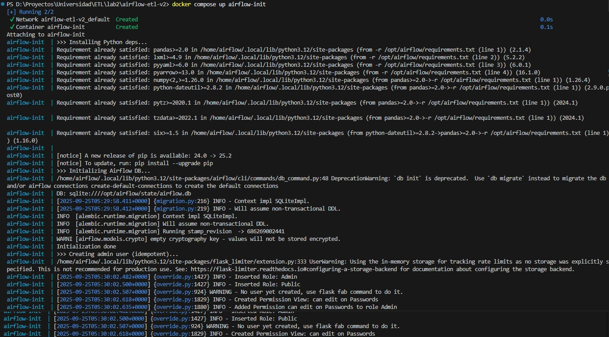

# Universidad Autonoma de Occidente 
# Maestria en IA y Ciencias de datos
---
# Integrantes:
* Pablo Andres Muñoz Martinez.
* Andres Felipe Hernandez
* Omar Sanchez
* Armando Betancurt
---

# Laboratorio 2 — ETL Automatizado con Logs y Monitoreo (Airflow en Docker)

Este proyecto empaqueta el pipeline del **Laboratorio 1** dentro de **Apache Airflow** ejecutándose con **Docker Compose**. El objetivo es correr el proceso ETL de forma programada, registrar su actividad en logs y producir los artefactos de salida.

> **Nota:**  El monitoreo se realiza mediante el log `state/etl.log` y el historial de runs de Airflow.

---

## Contenidos del repositorio

```text
airflow-etl/
├─ .env                               # UID de Airflow (opcional)
├─ docker-compose.yml                 # Servicios: airflow-init, scheduler, webserver
├─ requirements.txt                   # Dependencias del DAG/ETL (pandas, lxml, pyyaml, pyarrow)
├─ README.md                          # Este documento
├─ init/
│  └─ init.sh                         # Script de inicialización (pip + DB + usuario admin)
├─ dags/
│  ├─ etl_alumnos_dag.py              # DAG: start → extract → transform → load/log → export
│  └─ etl_utils.py                    # Funciones ETL (CSV/JSON/XML) y utilidades
├─ include/
│  └─ config.yaml                     # Parámetros de negocio (aprobación, escala, etc.)
├─ data/                              # Insumos (del Lab 1)
│  ├─ alumnos.csv
│  ├─ calificaciones.json
│  └─ matriculas.xml
├─ outputs/                           # Artefactos generados por el ETL
│  ├─ dataset_final.csv
│  └─ estudiantes_mongodb.json
└─ state/                             # Estado local y logs del pipeline
   ├─ airflow.db                      # DB interna de Airflow (solo dev)
   └─ etl.log                         # Historial de ejecuciones del ETL
```

---

## Requisitos locales

* **Docker** y **Docker Compose** instalados y en ejecución.
* Puertos libres: `8080` (Airflow Webserver).

---

## Cómo levantar el entorno

* Construir/actualizar imágenes :

  ```bash
  docker pull apache/airflow:2.9.2
  ```
* Inicializar Airflow :

  ```bash
  docker compose up airflow-init
  ```
* Levantar servicios en segundo plano:

  ```bash
  docker compose up -d
  ```

---

## Acceso a la interfaz de Airflow

* URL local: `http://localhost:8080`
* Usuario inicial: `airflow`
* Contraseña: `airflow`
* Acceso como administrador para pausar/activar/ejecutar DAGs y revisar logs.

---

## Uso del DAG `etl_alumnos_dag`

* Activar el toggle a la izquierda del DAG para permitir su ejecución (queda en estado **On**).
* Lanzar una corrida manual desde el botón ▶ del DAG o dejar el **schedule** diario activo (`@daily`).
* Seguir el progreso en la vista **Graph** o **Grid** del DAG y revisar los logs task por task.

---

## Qué hace el pipeline

* Carga insumos desde `data/`:

  * `alumnos.csv`
  * `calificaciones.json`
  * `matriculas.xml`
* Aplica limpieza y consolidación según `include/config.yaml` (umbrales y escala de notas).
* Escribe artefactos en `outputs/`:

  * `dataset_final.csv` con el dataset unificado para análisis/reportes.
  * `estudiantes_mongodb.json` modelado para persistencia/documentación en MongoDB.
* Registra la ejecución en `state/etl.log` con campos como: `run_id`, `start_ts`, `end_ts`, `duration_s`, `status`, `source_*_rows`, `output_rows`.

---

## Resultados esperados

* **Airflow levantado** y accesible en `http://localhost:8080` con credenciales de ejemplo (`airflow` / `airflow`).
* **DAG visible y activo** (`etl_alumnos_dag`) con historial de ejecuciones.
* **Artefactos generados** en `outputs/` tras ejecutar el DAG:

  * `dataset_final.csv` con columnas consolidadas (perfil, matrículas, calificaciones, indicadores de rendimiento, etc.).
  * `estudiantes_mongodb.json` con un documento por estudiante listo para carga en MongoDB.
* **Log consolidado** `state/etl.log` con una entrada por corrida del pipeline.

---

## Imagenes de compilacion y UI de Airflow

#### Airflow UI


#### Airflow UI run


#### Airflow UI status


#### Ejecución del DAG


#### Log del ETL


#### Log en Airflow


#### Salida CSV


#### Compilacion en Docker



## Entregables

* Script automatizado (DAG + utilidades): `dags/etl_alumnos_dag.py`, `dags/etl_utils.py`.
* Archivo de log de la ejecución: `state/etl.log`.
* Artefactos del ETL: `outputs/dataset_final.csv` y `outputs/estudiantes_mongodb.json`.
* Evidencia de programación/operación: pantallazo(s) de la UI de Airflow mostrando el DAG activo y su última corrida.

---

## Operación y mantenimiento

* Ver estado de contenedores:

  ```bash
  docker compose ps
  ```
* Ver logs de servicios:

  ```bash
  docker compose logs -f webserver
  docker compose logs -f scheduler
  ```
* Detener servicios:

  ```bash
  docker compose down
  ```
* Reiniciar servicios (tras cambios en DAGs o config):

  ```bash
  docker compose restart webserver scheduler
  ```
* Reset de entorno de desarrollo (elimina DB/estado/artefactos locales):

  ```bash
  docker compose down -v
  rm -rf state/* outputs/*
  docker compose up airflow-init && docker compose up -d
  ```

---

## Consideraciones

* La base de metadatos de Airflow se ejecuta sobre **SQLite** solo para **desarrollo**. Para producción, se recomienda Postgres/MySQL y un ejecutor distribuido.
* El monitoreo de esta entrega se limita a `state/etl.log` y al historial de Airflow. No se incluyó la tabla `etl_monitor` en SQLite.
* Los umbrales y reglas de negocio pueden ajustarse en `include/config.yaml` sin modificar el DAG.

---

## Créditos y licencia

* Apache Airflow © Apache Software Foundation.
* Este proyecto académico está orientado a fines de práctica educativa.
